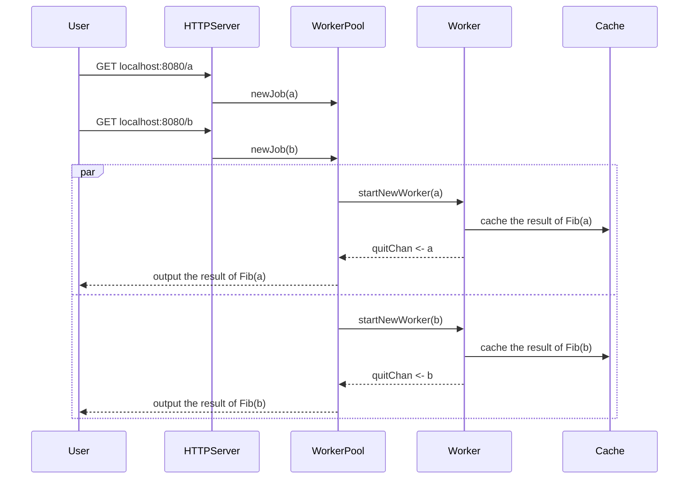

# Cache Worker Pool Project 

1. [Introduction](#introduction-and-description-of-the-project-a-nameintroductiona)
2. [Architecture](#architecture-and-design)
3. [To Be Done](#to-be-done)

## Introduction and Description of the Project 

The idea of this project is to design and construct a **worker pool** to manage several workers in order to concurrently compute Fibonacci numbers via recursion. Moreover, a very basic cache will be implemented, in order to store only final results. It is done in this way because implementing a much better cache practically destroys the need of working with several workers; it becomes too fast. There are a lot of improvements to be done, detailed later on. 

## Architecture and Design 
An HTTPServer is implemented as a first layer. The User sends a GET Request specifying for which $n$ we want to compute $Fib(n)$. At this point, the WorkerPool is in charge of managing the how and when each Worker should start. In fact, there is a maximum number of allowed Workers. However, the jobQueue can be filled forever and, if all the Workers are busy, the first one to finish will get another job from the queue. 

**Note:** The current design of the program does not work in a FIFO way, it depends on the execution time. I propose this point as a possible improvent into the code. 

When a Worker finish, it caches the result of the $Fib(n)$ operation into a key-value database that lives only in the execution time. Of course, another possible improvement is to save this DB into the FS. We can improve it further by sending a signal each time a Worker finishes in order to check if another Worker can use this value in order to reduce computation time. For example, if we are computing $Fib(100), Fib(101)$ and $Fib(102)$ and we finish computing $Fib(100)$ and $Fib(101)$, we can immediatelly compute $Fib(102)$ simply as looking at the cache. The problem is that, in the way it is currently implemeneted, the Worker will finish without checking if it can use both results. 

Below, I present a sequence diagram of all the Architecture:

## To be Done

- Read about how to depict formally correct Sequence diagrams and UML diagrams.
- Try to improve the Architecture.
- Solve the problems presented before. 
